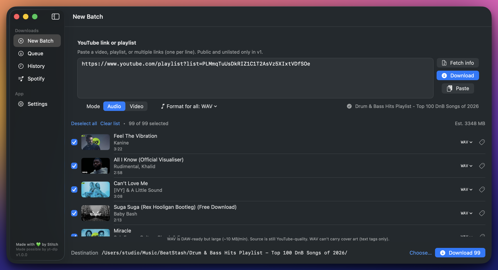
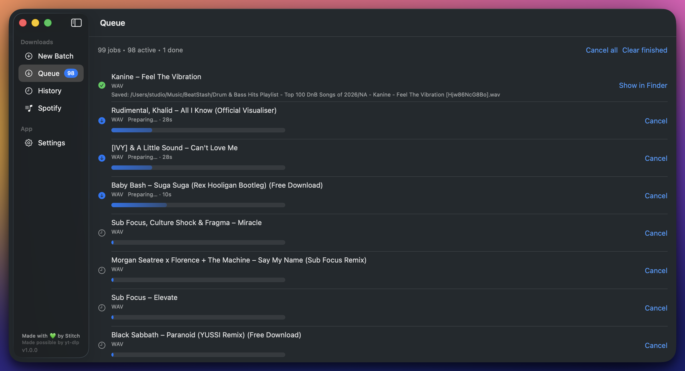
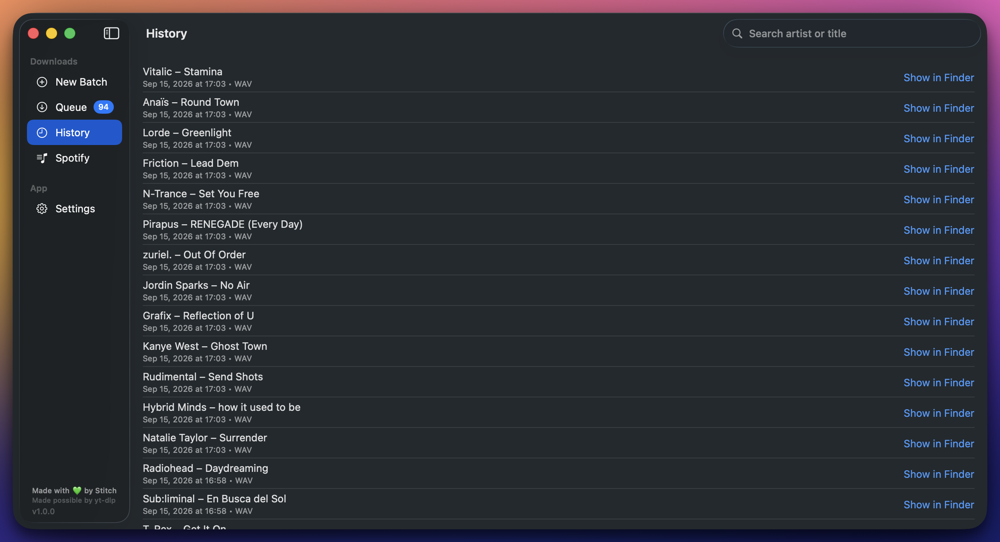
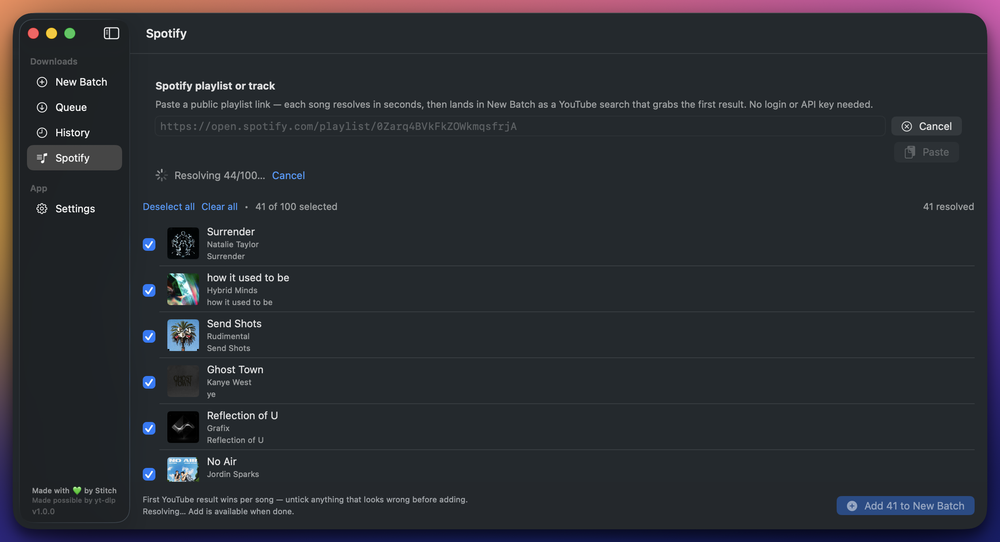
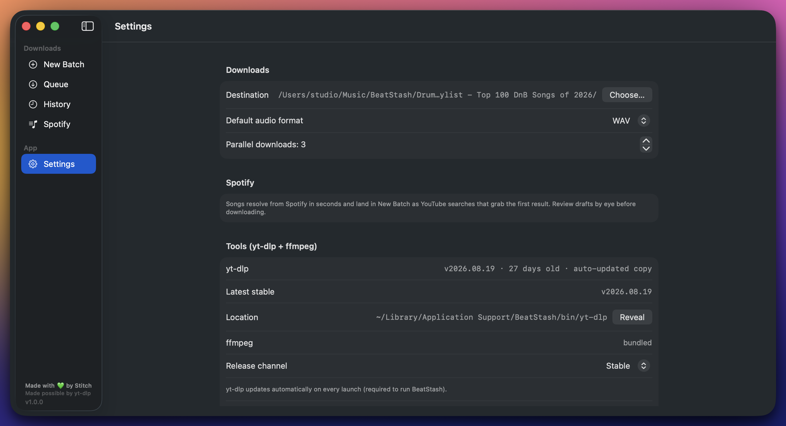

# BeatStash

Turn YouTube links and Spotify playlists into a tagged local music library — on your Mac, no server, no Homebrew, no API keys.


## Screenshots

| New Batch | Queue |
|---|---|
|  |  |

| History | Spotify |
|---|---|
|  |  |

| Settings |
|---|
|  |

> Screenshots land here as `docs/screenshots/<tab>.png` — same filenames, no README edits needed.

## What it does

- **New Batch** — paste YouTube links or bare video IDs (one per line, comma- or space-separated), probe them, then Fetch info or Download. Playlists, Shorts, and single videos supported.
- **Queue** — live progress, speed/ETA, cancellation, and automatic re-queue of transient failures.
- **History** — everything you've downloaded, with metadata and artwork.
- **Spotify** — paste a public Spotify playlist or track link; BeatStash matches each song to YouTube (Deezer + MusicBrainz duration anchors, confidence badges) and hands the picks to a new batch. No Spotify API key needed.
- **Settings** — audio format (Opus, M4A, MP3 320, FLAC, WAV), yt-dlp update channel (stable/nightly), cookies/browser auth, IPv4, and library location.
- Downloads are tagged (artist/title/album/track/year/genre + cover art) via an ffmpeg post-pass and land in your library folder, ready for any DAW or player.

## Install

1. Download `BeatStash-1.0.0.dmg` from the [releases page](https://github.com/StitchProductions/BeatStash/releases).
2. Open it and drag **BeatStash** into **Applications**.
3. First launch: right-click the app → **Open** (the app is ad-hoc signed, so Gatekeeper asks once), agree to automatic yt-dlp updates, and you're in.

Requires macOS 15 or later. Everything needed (yt-dlp, ffmpeg, ffprobe) ships inside the app — nothing else to install.

## Build from source

```sh
git clone https://github.com/StitchProductions/BeatStash.git
cd BeatStash
scripts/setup-binaries.sh        # fetches yt-dlp + ffmpeg/ffprobe into Vendor/ and stages them for Xcode
open BeatStash.xcodeproj         # or: xcodebuild test -scheme BeatStash -destination 'platform=macOS'
```

Make a release DMG:

```sh
scripts/package-dmg.sh --version 1.0.0   # → dist/BeatStash-1.0.0.dmg
```

## Tests

83 tests across 11 suites (`BeatStashTests/`), run on every push via GitHub Actions — see the badge above. Run them locally:

```sh
xcodebuild test -scheme BeatStash -destination 'platform=macOS'
```

Suites cover URL/Spotify-link parsing, tag parsing, YouTube matching + cache TTL, probe-error classification and retry chains, download argument building, auth/client chains, oEmbed shapes, and version comparison. A headless end-to-end smoke test lives in `scripts/smoke-test.sh`.

## Credits

BeatStash stands on excellent open-source work — thank you:

- **[yt-dlp](https://github.com/yt-dlp/yt-dlp)** (The Unlicense) — video/audio extraction, playlist probing, format merging. Bundled in the app and self-updated from Settings.
- **[FFmpeg / FFprobe](https://ffmpeg.org)** (GPL/LGPL depending on build) — audio transcoding, thumbnail embedding, tag post-pass.
- **[Deno](https://deno.com)** (MIT, optional) — JS runtime for YouTube proof-of-origin challenges.
- **[bgutil-ytdlp-pot-provider](https://github.com/Brainicism/bgutil-ytdlp-pot-provider)** (optional, not bundled) — automatic PO-token generation; drop into `Vendor/plugins/`.
- **[Deezer](https://developers.deezer.com)**, **[MusicBrainz](https://musicbrainz.org)**, and **Spotify oEmbed** — free metadata surfaces used for duration anchors and track info. No keys required.

Full license details in [Third-Party-Notices.md](Third-Party-Notices.md). If you redistribute BeatStash with FFmpeg binaries, honor the applicable GPL/LGPL source-offer requirements noted there.

Made with 💚 by Stitch — and possibly by yt-dlp.
